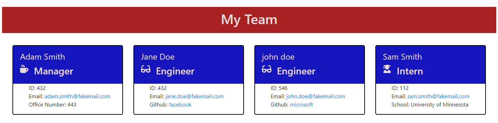

## Purpose
A CLI application that takes information about employees on a software engineering team and generates an HTML webpage that displays summaries for each person. The webpage contains links to the employee's github pages (if any exist) and email. This application utilizes Jest and Inquirer. 

## Screenshot

## Github URL: 
<https://github.com/smith-utxo/Team-Profile-Generator>

## Legal Notice
 © Adam T. Smith, U of M Coding Boot Camp 

Licensed under the [MIT license](LICENSE)

## Contributors 
- Adam T. Smith <smith.adam937@gmail.com> 
